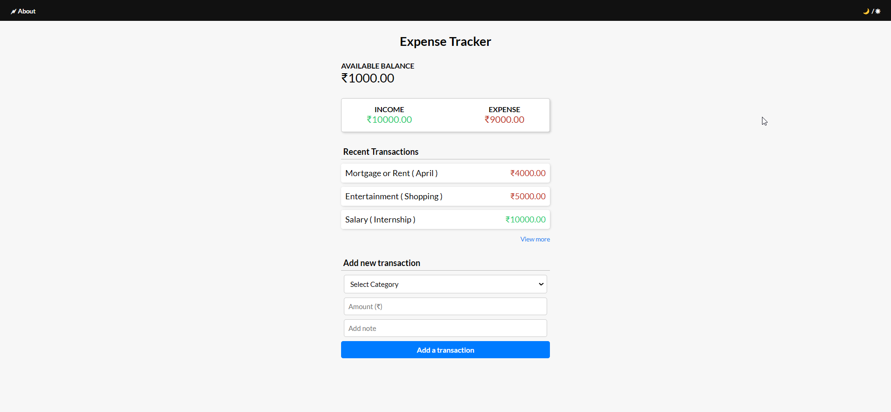

# expense-tracker
Personal Expense Tracker web application built with Django.

A user-friendly web application built with Django, helping users to manage their finances by tracking expenses and income effortlessly.

### Technologies Used

- HTML (for creating the structure of web pages)
- CSS (for styling) <!-- - JavaScript (for adding functionality) -->
- Django (for the backend)

### Usage

- Add a Transaction.
- View historical transactions.
- Update and Delete a transaction.

### To Do:

- [x] Update and Delete a transaction
- [ ] Login/Signup
- [ ] Dark Mode

### Getting Started

- Clone the repository (`git clone <repository_url>`).
- Run in your browser.
